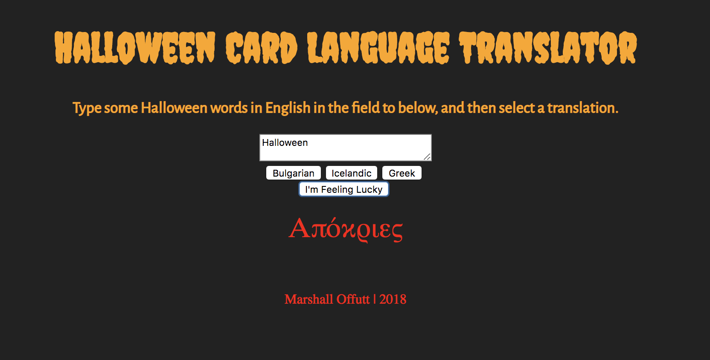

# Language Translator for a Halloween Card

## Description
This is a very limited language translator app, where the user can type Halloween-ish words into the input field, and the app will translate those words into Bulgarian, Greek, or Icelandic. This project is an exploration of JavaScript functions using arrays, for loops, and conditional statements.

## Screenshots


## How to run this project
* Clone the repository to your local machine.
* Use npm to install http-server in your terminal:
```sh
npm install -g http-server
```
* Run the server in your terminal
```sh
hs -p 9999
```
* Open chrome and navigate to:
```
localhost: 9999
```
